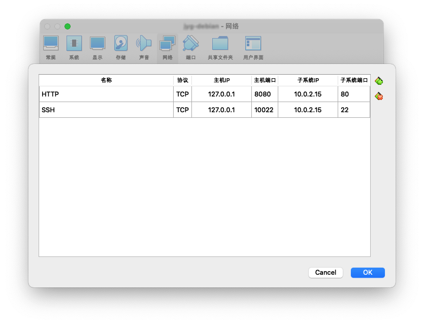

# VirtualBox

## 6.1

### 网络设置

虚拟机的网卡有以下几种设置

* Network Address Translation (NAT)
  * 虚拟机通过 NAT 方式接入外网
  * 虚拟机网卡自动获得地址默认为 10.0.2.15/24（取决于同一虚拟机上有几块此模式的网卡），网关为 10.0.2.2
  * 虚拟机之间不能通信
  * 虚拟机可以访问主机，主机不能直接访问虚拟机
  * 不需要物理网卡支持
* NAT Network
  * 在全局设定处可以增加 NAT 网络
  * 虚拟机通过 NAT 方式接入外网
  * 接入同一网络的虚拟机网卡之间可以通信
  * 虚拟机可以访问主机，主机不能直接访问虚拟机
  * 不需要物理网卡支持
* Bridged networking
  * 桥接方式，相当于虚拟机直接接入外网
  * 需要物理网卡支持
* Internal networking
  * 由 VirtualBox 在虚拟机之间转发
  * 虚拟机之间可以通信
  * 主机与虚拟机不能通信
  * 不需要物理网卡支持
* Host-only networking
  * 在“主机网络管理器”里可以增加网络
  * 主机与虚拟机之间可以通信
  * 不需要物理网卡支持

其他模式不详。

可以给虚拟机安装双网卡，一个为 NAT 模式，一个为 Host-only 模式。这样虚拟机可以访问外网，主机可以访问虚拟机，并且克服了 Bridged 方式下必须有物理网卡支持的缺点。

这种方法的一个问题是两个网卡同时连接到主机可能引起冲突，一些操作系统不允许这样的配置。

如果只是把虚拟机当服务器用，可以只使用一个 NAT 模式的网卡，配置端口转发到主机 IP.

